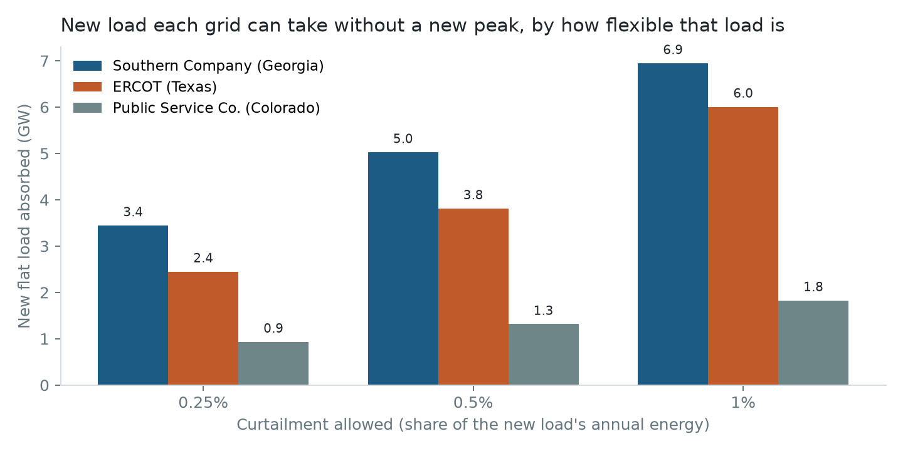
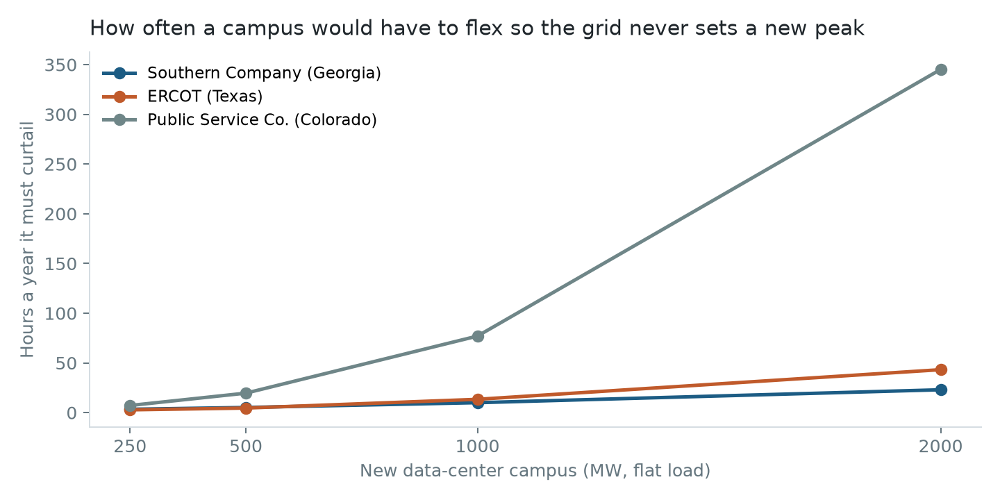

# How much new data-center load can the grid take, and what does flexibility buy?

A what-if model for three grids that serve Atlanta, Austin and Denver-area sites: **Southern
Company (SOCO, Georgia)**, **ERCOT (Texas)** and **Public Service Co. of Colorado (PSCO)**. It uses
five years (2021-2025) of hourly demand from the EIA-930 grid monitor, **131,472 hours**, after a
data-quality pass that found the raw series would have doubled two grids' peaks.

## The answer

| | Georgia (SOCO) | Texas (ERCOT) | Colorado (PSCO) |
|---|---|---|---|
| New flat load absorbable if it can curtail **0.25%** of its annual energy | 3.4 GW | 2.4 GW | 0.9 GW |
| ... at **0.5%** | **5.0 GW** (11% of peak) | **3.8 GW** (5%) | **1.3 GW** (14%) |
| ... at **1%** | 6.9 GW | 6.0 GW | 1.8 GW |
| Hours a year a **1 GW campus** must flex | 10 | 13 | 77 |
| Longest curtailment event at 0.5% | 15 hours (a winter storm) | 7 hours | 9 hours |

- **Flexibility is the capacity.** With no flexibility, any new load sets a new peak somewhere in
  the year. Agreeing to curtail half a percent of annual energy unlocks 1.3 to 5 GW per grid.
- **Where to put a large campus:** Georgia and Texas absorb a 1 GW campus with about 10 to 13 hours of
  flex a year. Colorado needs 77, and a 2 GW campus there would need 345 hours (1.25% of its energy).
- **When to flex:** in Texas and Colorado, curtailment falls almost entirely on summer afternoons.
  In Georgia, 9% of the hours come in winter, and the longest event (15 hours, Dec 2022) was Winter
  Storm Elliott, so a Georgia flex plan has to cover long cold-snap events, not only summer peaks.

The one-page recommendation is in [MEMO.md](MEMO.md).

## Data quality first

Every what-if here is measured against each year's peak, so a bad peak breaks everything.
[src/quality.py](src/quality.py) runs five checks on the demand each utility submitted and writes
[results/quality_summary.csv](results/quality_summary.csv), the flagged hours and
[results/alerts.json](results/alerts.json).

| Check | SOCO | ERCOT | PSCO |
|---|---|---|---|
| Raw peak vs true peak | **92,428 vs 48,073 MW (1.9×)** | 85,544 vs 85,544 | **19,352 vs 9,853 MW (2.0×)** |
| Missing values / non-positive hours | 0 / 0 | 48 / 0 | 24 / 12 |
| Hours flagged | 95 | 86 | 139 |
| Hours EIA itself corrected | 3 | 24 | 37 |
| Share of EIA's corrections our checks caught | 100% | 100% | 100% |
| Cleaned series within 1% of EIA's, share of hours | 99.8% | 99.8% | 99.7% |
| Days of spikes EIA left unchanged, queued for review | 19 | 6 | 15 |

- **Spike rule.** Each hour is compared with the median of the same hour on the three days either
  side, and flagged if it is 35% away. The first version compared each hour with a rolling median
  across the day. It flagged every normal afternoon peak (1,222 to 3,227 hours per grid) and would have
  "cleaned" the real peaks away. The version above was scored against the hours EIA corrected.
- **Alerts go to a person, not an auto-fix.** The flags EIA left alone cluster on Winter Storm
  Elliott (Dec 23-24, 2022), Winter Storm Landon (Feb 3-4, 2022) and January cold snaps. That is
  real demand. So the spike check opens a review, and the what-if runs on EIA's adjusted series.
- **Forecast check.** PSCO's day-ahead forecast error jumped from 2.8% (2021-22) to 46.7% in 2023,
  and stayed above 5% since, while SOCO and ERCOT stayed at 1.2% to 3.0%. That is an alert on the
  forecast feed itself, worth raising with the source before anyone uses it.

## Method

For each grid and year: add a flat new load L to every hour. Wherever demand plus L would exceed
that year's peak (the most the system actually served), the new load curtails by the excess. The
curtailment rate is curtailed energy divided by L's annual energy. Headroom at 0.5% is the largest L
whose rate stays at or below 0.5%, found by bisection, then averaged over 2021-2025. The worst year
is kept too: at 0.5%, SOCO 4.2 GW, ERCOT 3.0 GW, PSCO 1.0 GW. All SQL runs in DuckDB over the raw
EIA files ([sql/01_hourly_demand.sql](sql/01_hourly_demand.sql)).





## KPIs by grid

| | Peak 2021 → 2025 (MW) | Load factor 2025 | Day-ahead forecast error 2025 |
|---|---|---|---|
| SOCO | 45,072 → 46,490 (2022 high 48,073) | 0.59 | 1.2% |
| ERCOT | 73,476 → 83,597 (2024 high 85,544) | 0.67 | 2.5% |
| PSCO | 9,853 → 9,079 | 0.57 | 7.6% (alert) |

Full table: [results/kpi_by_year.csv](results/kpi_by_year.csv).

## Limitations

- **A screen, not a plan.** The threshold is the peak each system already served, so this ignores
  transmission limits, local substation constraints, reserve margins and new generation.
- **Flat load, perfect flex.** It assumes a flat new load that can drop exactly the excess each hour.
  Real campuses have minimum loads, and shifting has limits.
- **Balancing-authority totals.** A site's feasibility depends on the local network, which EIA-930 does not show.
- **Five years of weather.** A worse winter storm than Elliott would lengthen the longest event.

## Reproduce

```bash
DATA_DIR=/path/with/space bash scripts/download.sh   # 10 EIA-930 six-month files, about 430 MB
pip install -r requirements.txt
export DATA_DIR=/path/with/space
python src/build.py && python src/quality.py && python src/headroom.py
pytest -q
```
